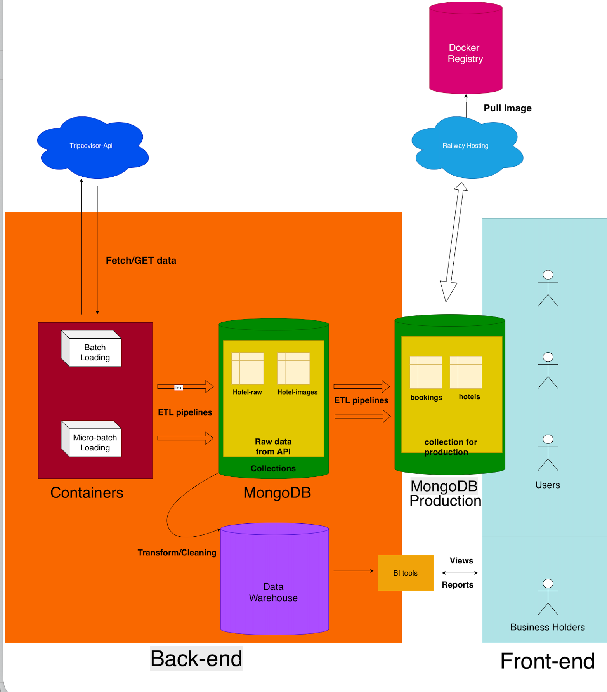

# Hotel Data System Overview

## 1. Architecture Overview
The system consists of three main layers:

- **Backend & Data Layer:** Containers for ETL, MongoDB, and Data Warehouse.
- **Frontend Layer:** Interface for users and business holders.
- **Deployment:** Code stored in repository, deployed via Render Hosting.

This architecture allows processing hotel data from Tripadvisor API, storing in MongoDB, providing frontend data, and enabling analytics via Data Warehouse.

## 2. System Workflow

### 2.1 Data Collection & Processing
- **Batch Loading:** Large-scale data load (hotel info, images, reviews) periodically.
- **Micro-batch Loading:** Frequent small updates to capture new data.
- ETL pipelines transform and clean data before storing in MongoDB.

### 2.2 Data Storage & Organization
MongoDB databases:
- **Hotel-Info:** Hotel details.
- **Hotel-Images:** Image URLs.
- **Reviews:** User reviews.

Data is pushed to **Data Warehouse** for:
- Normalization
- Analytical aggregation
- BI reporting

### 2.3 User Interaction & Transactions
- Frontend sends requests to backend (Render deployed).
- Backend handles MongoDB operations (fetch info, add reviews, display images) and returns results in real-time.

### 2.4 Reporting & Analytics
- Data Warehouse connects to BI tools for dashboards, activity reports, and hotel trend analysis.
- Reports are available via frontend views.

### 2.5 Deployment
- Source code in repository.
- Render Hosting builds and deploys backend/frontend.
- ETL containers run as background services.

## 3. Summary
- Collect data → process → store in MongoDB
- Use Data Warehouse for analytics
- Frontend serves users and business owners
- Backend handles logic & database
- Deployment automated via Render
- Separation of ETL, transaction, and analytics flows ensures scalability and stability

## 4. Tripadvisor API
- Provides hotel, restaurant, attraction data.
- Features: details, up to 5 photos & reviews, 50 requests/sec, pay-per-use.
- Main endpoints: Location Details, Photos, Reviews, Search, Nearby Search.
- Pros: Rich, reliable, single source of truth.
- Cons: Data parsing complexity, low rate limit on free tier.

## 5. ETL Containers / Microservices
- **Batch Loading:** Large periodic loads.
- **Micro-batch Loading:** Frequent small updates for near real-time data.
- **ETL Pipelines:** Extract, transform, clean, and load to MongoDB/Data Warehouse.
- Containers ensure consistent environment, independent processing, and scalability.

## Overview Architecture
